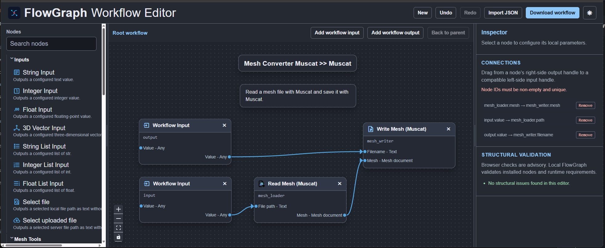
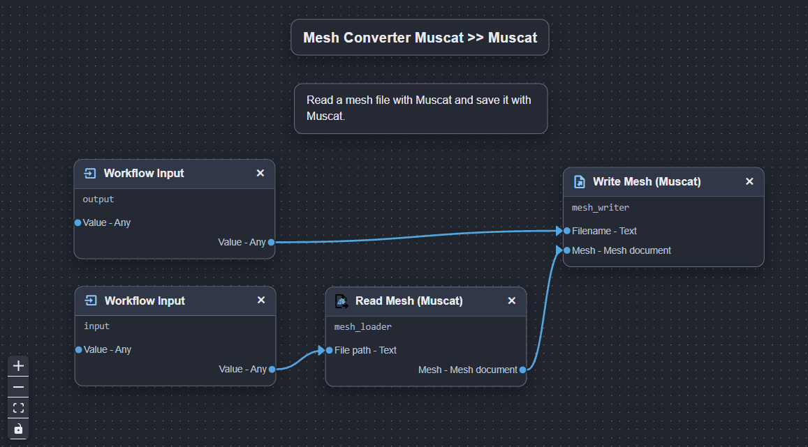
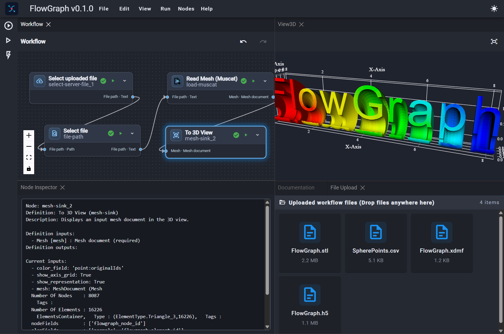

# Design workflows visually. Execute them where your data lives.

FlowGraph gives you three complementary ways to work with typed data-processing
pipelines: author them in the browser, inspect and run them from the command line,
or execute and explore them in the full desktop application.

## 1. Author workflows in the Web Editor

Start with the FlowGraph Web Editor when you want to sketch a pipeline, explore the
node catalog, or share a workflow definition with someone else. Arrange nodes on a
canvas, connect named ports, configure parameters, and download the result as
versioned `flowgraph-workflow` JSON.



The Web Editor makes the structure of a workflow easy to review:

- Search reusable input, reader, processing, viewer, and writer nodes.
- Connect compatible typed ports directly on the canvas.
- Define workflow inputs and outputs for reusable pipelines.
- Import an existing workflow or download the edited JSON.
- Run supported workflows in the persistent local Python/WASM worker.
- Review Python-generated execution results and workflow projections.
- Download JSON for local-only capabilities such as VTK views and local-path I/O.

The checked-in Web Editor runtime supports a VTK-free browser capability set that includes
the staged FlowGraph, Muscat, NumPy, SciPy, SymPy, Pillow, and Dill packages. It does not
provide arbitrary local filesystem paths, desktop views, VTK, or adapters outside the browser
registry. Browser execution isolates work from the UI thread, but it is not an adversarial-code
sandbox; use a separately isolated server runtime when hostile-code isolation is required.

[Open the FlowGraph Web Editor](https://www.fbw-es.com/flowgraph-editor)

## 2. Inspect and run workflows from the command line

Once a workflow is saved, the `flowgraph` command provides a scriptable path for
inspection and execution. This is useful for automation, batch processing, CI jobs,
or running the same workflow with different input files and parameters.



Inspect a workflow without opening the graphical application:

```bash
uv run flowgraph inspect workflow.json
```

Run a workflow with published inputs:

```bash
uv run flowgraph run workflow.json \
  --input mesh_path=/data/input.stl \
  -i threshold=0.5
```

`-i` is the short form of `--input`. Repeat either option for each published
input; you can mix both forms in the same command.

Override a node parameter for one run without changing the saved JSON:

```bash
uv run flowgraph run workflow.json \
  --override file-path.path=/data/input.stl \
  --override output-path.path=/data/output.xdmf
```

The command-line runner preserves the workflow as a reusable definition while
allowing runtime-specific paths, inputs, and parameter values. Public outputs can
also be written to a JSON file for downstream automation.

## 3. Execute and explore in the desktop application (coming soon)

Use the full FlowGraph application when you need interactive execution, local file
access, node inspection, visualization, or a closer look at intermediate results.
The same local Trame application can run in a browser during development or in the
optional PyWebView desktop shell.



The desktop workspace brings the workflow graph together with its results:

- Execute a complete workflow or an individual node branch.
- Inspect configured parameters, connected inputs, outputs, and execution errors.
- Visualize finite-element mesh results in the 3D view.
- Preview Pillow image results inside the application.
- Upload and select local files for workflow inputs.
- Save, reload, and refine workflows without rebuilding the pipeline from scratch.

## Typed graphs for reproducible data processing

FlowGraph workflows are directed graphs of nodes with named, typed ports. A typical
pipeline moves from an input or reader, through one or more processing steps, to a
viewer or writer. Validation helps identify incompatible connections, missing
endpoints, duplicate inputs, and cycles before execution.

FlowGraph is designed to keep the important parts of a workflow visible and
repeatable:

- **Connect with confidence.** Ports carry explicit data types such as `Text`,
  `Image`, and `Mesh document`. Registered conversions make supported adaptations
  visible.
- **Save and share.** Workflow JSON stores node definitions, parameters, canvas
  positions, and port-addressed connections.
- **Extend by adapter.** New data types, node definitions, readers, writers, and
  integrations can be added without changing the core graph engine.

## What you can build today

### Finite-element mesh workflows

Mesh adapters support reading, inspecting, transforming, visualizing, and writing
finite-element models. The local 3D workspace combines the workflow graph with
Muscat-backed mesh data and VTK visualization.

### Pillow image workflows

The Image Tools adapter supports reading and writing Pillow images, displaying image
results, and applying operations such as resizing, cropping, rotation, and mode
conversion. Image operations use the same typed workflow engine as mesh pipelines.

## Start exploring

1. Follow the [installation guide](installation.md).
2. Create or open your [first project](first-project.md).
3. Learn the local workspace in the [interface guide](../user-guide/interface.md).
4. Build reusable pipelines with the [workflows guide](../user-guide/workflows.md).