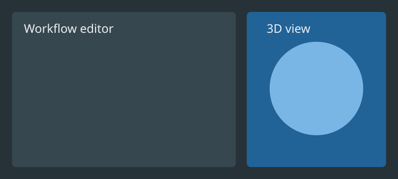

# Interface

The workflow editor, 3D view, and inspectors can be arranged with DockView.

Learn how [workflow nodes](../reference/nodes.md) represent operations, ports,
parameters, and outputs.

See [Importing Data](importing-data.md) for loading datasets and [Color Maps](visualization.md#color-maps) for rendering controls.